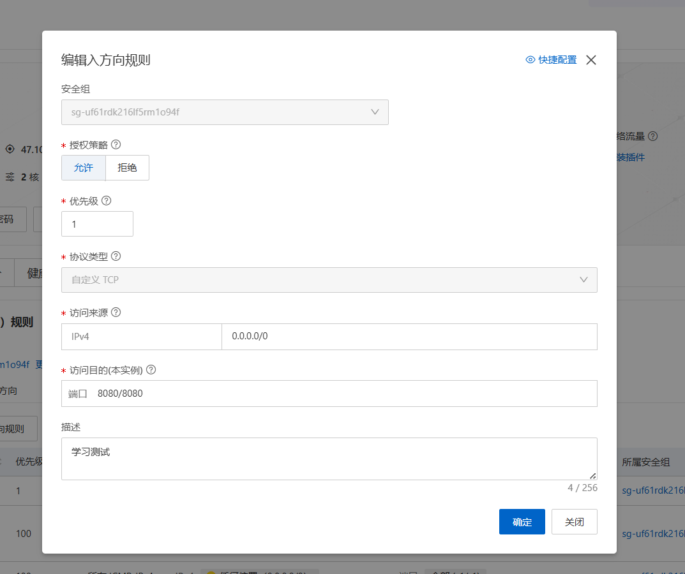

# 目标

- **D36** 网络诊断：ip、ss、ping
- **D37** curl 与 HTTP 基础
- **D38** SSH 端口转发（本地转发远程服务）
- **D39** 防火墙基础：ufw
- **D40** 复盘日：网络场景练习

## D36

今天主要学习三个命令，分别是ip、ss、ping

|命令	|功能	|描述|
|------|-------|---|
|ip	|网卡与路由	|机器的网络档案（IP、网卡、去外网走哪条路）|
|ping|	连通性	|到目标主机路通不通？|
|ss|	连接	|这台机器上和谁在通话（端口、状态）|

先看网卡信息
```
ip addr
1: lo: <LOOPBACK,UP,LOWER_UP> mtu 65536 qdisc noqueue state UNKNOWN group default qlen 1000
    link/loopback 00:00:00:00:00:00 brd 00:00:00:00:00:00
    inet 127.0.0.1/8 scope host lo
       valid_lft forever preferred_lft forever
    inet6 ::1/128 scope host noprefixroute
       valid_lft forever preferred_lft forever
2: eth0: <BROADCAST,MULTICAST,UP,LOWER_UP> mtu 1500 qdisc fq_codel state UP group default qlen 1000
    link/ether 00:16:3e:33:b8:9d brd ff:ff:ff:ff:ff:ff
    altname enp0s5
    altname ens5
    inet 172.30.4.82/20 metric 100 brd 172.30.15.255 scope global dynamic eth0
       valid_lft 1891041981sec preferred_lft 1891041981sec
    inet6 fe80::216:3eff:fe33:b89d/64 scope link
       valid_lft forever preferred_lft forever
```
观察输出发现，输出中的ip和平时登录时使用的ip不同

因为这是阿里云的NAT设计，包先传送给阿里云的公网ip，然后阿里云再把包的目的ip改到服务器的内网ip上，最后机器接收到包信息

先挨个看是什么意思

lo:是指回环网卡，这个inet代表是自己的意思。

为什么要有一个回环网卡？

因为程序不管是谁，都用同一套socket接口，只写一个网络程序。

eth0:是真正的网卡

00:16:3e 开头的是MAC地址，这个是属于Xen虚拟化平台厂商的标识，我的ECS服务器是台虚拟机

172.30.4.82/20是私有的ip地址，/20是CIDR的记法，前20位是网络号，后12位是主机号

ip地址一共是32位，被分成4组，每组是8位十进制表示

主机号全1代表广播地址，即172.30.15.255

dynamic代表ip是DHCP动态分配的

mtu 1500代表一个包最大1500字节

网络信息基本就是这样，下面去看一下路由信息，怎么去到外网
```
ip route
default via 172.30.15.253 dev eth0 proto dhcp src 172.30.4.82 metric 100
100.100.2.136 via 172.30.15.253 dev eth0 proto dhcp src 172.30.4.82 metric 100
100.100.2.138 via 172.30.15.253 dev eth0 proto dhcp src 172.30.4.82 metric 100
172.30.0.0/20 dev eth0 proto kernel scope link src 172.30.4.82 metric 100
172.30.15.253 dev eth0 proto dhcp scope link src 172.30.4.82 metric 100
```
default是兜底规则，当目的地不匹配到下面任何一条时，发送给172.30.15.253

via是下一条的意思，它后面跟着的是网关

dev eth0是从哪个网卡出

proto dhcp的意思是自动附加的规则，这个规则来自dhcp；kernel代表是内核加的规则

src代表源地址从哪发出的

metric代表优先级，数字越小优先级越高

路由规则基本就是这样，下面看一下ping
```
ping -c 4 172.30.15.253     # 网关
PING 172.30.15.253 (172.30.15.253) 56(84) bytes of data.
64 bytes from 172.30.15.253: icmp_seq=1 ttl=64 time=0.164 ms
64 bytes from 172.30.15.253: icmp_seq=2 ttl=64 time=0.084 ms
64 bytes from 172.30.15.253: icmp_seq=3 ttl=64 time=0.094 ms
64 bytes from 172.30.15.253: icmp_seq=4 ttl=64 time=0.094 ms

--- 172.30.15.253 ping statistics ---
4 packets transmitted, 4 received, 0% packet loss, time 3066ms
rtt min/avg/max/mdev = 0.084/0.109/0.164/0.032 ms
ping -c 4 223.5.5.5         # 阿里云公共 DNS
PING 223.5.5.5 (223.5.5.5) 56(84) bytes of data.
64 bytes from 223.5.5.5: icmp_seq=1 ttl=58 time=6.24 ms
64 bytes from 223.5.5.5: icmp_seq=2 ttl=58 time=6.14 ms
64 bytes from 223.5.5.5: icmp_seq=3 ttl=58 time=6.40 ms
64 bytes from 223.5.5.5: icmp_seq=4 ttl=58 time=6.40 ms

--- 223.5.5.5 ping statistics ---
4 packets transmitted, 4 received, 0% packet loss, time 3003ms
rtt min/avg/max/mdev = 6.144/6.293/6.400/0.108 ms
ping -c 4 www.baidu.com     # 域名
PING www.a.shifen.com (180.101.51.73) 56(84) bytes of data.
64 bytes from 180.101.51.73: icmp_seq=1 ttl=47 time=13.6 ms
64 bytes from 180.101.51.73: icmp_seq=2 ttl=47 time=14.0 ms
64 bytes from 180.101.51.73: icmp_seq=3 ttl=47 time=13.5 ms
64 bytes from 180.101.51.73: icmp_seq=4 ttl=47 time=13.1 ms

--- www.a.shifen.com ping statistics ---
4 packets transmitted, 4 received, 0% packet loss, time 3004ms
rtt min/avg/max/mdev = 13.105/13.552/13.979/0.310 ms
```

观察输出结果发现，TTL百度最小，自己的网关最大，这是因为TTL是一个包最多还能活多少跳的意思

也就是说，TTL的数值越小说明两个之间传输的距离越远

下面看一下ss命令，
```
ss -tln             # -t只看TCP、-l只看listening、-n数字直出
State         Recv-Q        Send-Q               Local Address:Port               Peer Address:Port       Process
LISTEN        0             4096                       0.0.0.0:22                      0.0.0.0:*
LISTEN        0             4096                    127.0.0.54:53                      0.0.0.0:*
LISTEN        0             4096                 127.0.0.53%lo:53                      0.0.0.0:*
LISTEN        0             4096                          [::]:22                         [::]:*
```
**一个连接由五个要素唯一确定：协议 + 本机 IP + 本机端口 + 对方 IP + 对方端口**

观察输出，发现两个端口号是22的，这两个是sshd的监听，还有两个是53的，这两个是systemd-resolved(本机DNS的前台)

那么程序查域名的流程是这样的，先是把程序把DNS查询请求发去127.0.0.53中，然后systemd-resolved(也就是127.0.0.53)自己发起新的DNS查询请求、目的地是100.100.2.136，然后内核通过查询路由表，发现命中了"100.100.2.136 via 172.30.15.253 dev eth0"，然后就把这个请求交给网关172.30.15.253转运，接着这个请求到了100.100.2.136手中，最后拿到目的ip地址返回

## D37

每天用浏览器打开网页，背后发生了什么事情呢？

http(超文本传输协议)是一种浏览器与服务器之间使用的固定语言

下面看一次http对话
```
curl -v http://example.com

* Host example.com:80 was resolved.
* IPv6: 2606:4700:10::6814:179a, 2606:4700:10::ac42:93f3
* IPv4: 104.20.23.154, 172.66.147.243
*   Trying 104.20.23.154:80...
*   Trying [2606:4700:10::6814:179a]:80...
* Immediate connect fail for 2606:4700:10::6814:179a: Network is unreachable
*   Trying [2606:4700:10::ac42:93f3]:80...
* Immediate connect fail for 2606:4700:10::ac42:93f3: Network is unreachable
* Connected to example.com (104.20.23.154) port 80
> GET / HTTP/1.1
> Host: example.com
> User-Agent: curl/8.5.0
> Accept: */*
>
< HTTP/1.1 200 OK
< Date: Fri, 28 Aug 2026 09:44:24 GMT
< Content-Type: text/html
< Transfer-Encoding: chunked
< Connection: keep-alive
< Server: cloudflare
< Last-Modified: Tue, 18 Aug 2026 20:06:42 GMT
< Allow: GET, HEAD
< Accept-Ranges: bytes
< Age: 512
< cf-cache-status: HIT
< CF-RAY: a32260927bd1360e-FRA
<
<!doctype html><html lang="en"><head><title>Example Domain</title><link rel="icon" href="data:,"><meta name="viewport" content="width=device-width, initial-scale=1"><style>body{background:#eee;width:60vw;margin:15vh auto;font-family:system-ui,sans-serif}h1{font-size:1.5em}div{opacity:0.8}a:link,a:visited{color:#348}</style></head><body><div><h1>Example Domain</h1><p>This domain is for use in documentation examples without needing permission. Avoid use in operations.</p><p><a href="https://iana.org/domains/example">Learn more</a></p></div></body></html>
* Connection #0 to host example.com left intact
```
curl是命令行中的无头浏览器，只看最原始的对话文本，-v是让curl把幕后的动作显示出来

分析输出，第一行说明curl拿到网址后第一件事做的事解析这个域名，解析完成后拿到了v4和v6版本的ip地址，接着它根据路由表访问这两个ip地址，发现v6的ip地址尝试访问了两边都断联了，最后在v4版本的第一个ip地址中成功在80端口建立连接，>这个箭头是本地发送出去的信息，\<这个箭头是服务器发来的信息，紧接着是我给服务器发送的信息

> GET / HTTP/1.1

这个是请求行，有三个要素，方法(GET)、路径(/根目录)、协议版本(HTTP/1.1)
> Host: example.com

这个是域名，确定信息发给对应的人
> User-Agent: curl/8.5.0

这个是告诉对面服务器，我是谁
> Accept: */*

这个是告诉对面服务器，什么样格式的回复我都接受
```
< HTTP/1.1 200 OK
< Date: Fri, 28 Aug 2026 09:44:24 GMT
< Content-Type: text/html
< Transfer-Encoding: chunked
< Connection: keep-alive
< Server: cloudflare
< Last-Modified: Tue, 18 Aug 2026 20:06:42 GMT
< Allow: GET, HEAD
< Accept-Ranges: bytes
< Age: 512
< cf-cache-status: HIT
< CF-RAY: a32260927bd1360e-FRA
<
<!doctype html><html lang="en"><head><title>Example Domain</title><link rel="icon" href="data:,"><meta name="viewport" content="width=device-width, initial-scale=1"><style>body{background:#eee;width:60vw;margin:15vh auto;font-family:system-ui,sans-serif}h1{font-size:1.5em}div{opacity:0.8}a:link,a:visited{color:#348}</style></head><body><div><h1>Example Domain</h1><p>This domain is for use in documentation examples without needing permission. Avoid use in operations.</p><p><a href="https://iana.org/domains/example">Learn more</a></p></div></body></html>
```
看一下服务器回复的信息，首先是HTTP/1.1 200 OK，200状态代表成功的意思
当然状态码还有其它的，
|家族	|含义|
|------|----|
|2xx	|成功（200 OK）|
|3xx	|重定向|
|4xx	|你的错（404 没这页、403 不让你看）|
|5xx	|服务器的错（500 炸了、502 上游挂了）|

重点看一下age:512，cf-cache-status:HIT，说明这份回复在cloudflare中存了512秒直接命中缓存，没有去访问源网址

CF-RAY: a32260927bd1360e-FRA这个FRA代表的是节点代码，是德国的意思

尝试去访问一下不存在的东西
```
curl -v http://example.com/nonexistent-page

* Host example.com:80 was resolved.
* IPv6: 2606:4700:10::6814:179a, 2606:4700:10::ac42:93f3
* IPv4: 104.20.23.154, 172.66.147.243
*   Trying 104.20.23.154:80...
* Connected to example.com (104.20.23.154) port 80
> GET /nonexistent-page HTTP/1.1
> Host: example.com
> User-Agent: curl/8.5.0
> Accept: */*
>
< HTTP/1.1 404 Not Found
< Date: Fri, 28 Aug 2026 10:16:27 GMT
< Content-Type: text/html
< Transfer-Encoding: chunked
< Connection: keep-alive
< Server: cloudflare
< Age: 10940
< cf-cache-status: HIT
< CF-RAY: a3228f86ccdd8fe8-FRA
<
<!doctype html><html lang="en"><head><title>Example Domain</title><link rel="icon" href="data:,"><meta name="viewport" content="width=device-width, initial-scale=1"><style>body{background:#eee;width:60vw;margin:15vh auto;font-family:system-ui,sans-serif}h1{font-size:1.5em}div{opacity:0.8}a:link,a:visited{color:#348}</style></head><body><div><h1>Example Domain</h1><p>This domain is for use in documentation examples without needing permission. Avoid use in operations.</p><p><a href="https://iana.org/domains/example">Learn more</a></p></div></body></html>
```
发现大部分输出没有变化，只有在服务器给的信息中，出现了404 not Found

```
curl -I http://github.com
HTTP/1.1 301 Moved Permanently
Content-Length: 0
Location: https://github.com/
```
-I代表是只发送HEAD请求，只要响应头，不要响应体
发现被拒绝了，说明它的位置已经更改了，同时它告诉你重定向的网址在哪
curl默认不跟随，只是拿到响应头就结束，浏览器通常在看到3xx之后会自动跳转，所以平时感知不到重定向
为什么要把http变成https，因为http是明文传输，输入密码和内容沿途任何人都可以看见，https是TLS加密，正经网站都强制使用https，百度不正经
下面跟随重定向看一下，用-L参数
```
curl -IL http://github.com

HTTP/1.1 301 Moved Permanently
Content-Length: 0
Location: https://github.com/

HTTP/2 200
date: Fri, 28 Aug 2026 10:29:38 GMT
content-type: text/html; charset=utf-8
content-language: en-US
```
只抓取前面几个重要部分，可以看到有两个HTTP回文，状态码分别是301和200，说明是经过重定向后访问成功
第二个HTTP变成了版本2，因为这走的是https，TLS握手的时候服务器和客户端会对比版本，服务器有版本2，所以用了版本2

下面看一下响应体内部信息
```
curl -o ~/baidu.html http://www.baidu.com
wc -c ~/baidu.html
head -5 ~/baidu.html

<!DOCTYPE html>
<!--STATUS OK--><html> <head><meta http-equiv=content-type content=text/html;charset=utf-8><meta http-equiv=X-UA-Compatible content=IE=Edge><meta content=always name=referrer><link rel=stylesheet type=text/css href=http://s1.bdstatic.com/r/www/cache/bdorz/baidu.min.css><title>百度一下，你就知道</title></head> <body link=#0000cc> <div id=wrapper> <div id=head> <div class=head_wrapper> <div class=s_form> <div class=s_form_wrapper> <div id=lg>  </div> <form id=form name=f action=//www.baidu.com/s class=fm> <input type=hidden name=bdorz_come value=1> <input type=hidden name=ie value=utf-8> <input type=hidden name=f value=8> <input type=hidden name=rsv_bp value=1> <input type=hidden name=rsv_idx value=1> <input type=hidden name=tn value=baidu><span class="bg s_ipt_wr"><input id=kw name=wd class=s_ipt value maxlength=255 autocomplete=off autofocus></span><span class="bg s_btn_wr"><input type=submit id=su value=百度一下 class="bg s_btn"></span> </form> </div> </div> <div id=u1> <a href=http://news.baidu.com name=tj_trnews class=mnav>新闻</a> <a href=http://www.hao123.com name=tj_trhao123 class=mnav>hao123</a> <a href=http://map.baidu.com name=tj_trmap class=mnav>地图</a> <a href=http://v.baidu.com name=tj_trvideo class=mnav>视频</a> <a href=http://tieba.baidu.com name=tj_trtieba class=mnav>贴吧</a> <noscript> <a href=http://www.baidu.com/bdorz/login.gif?login&amp;tpl=mn&amp;u=http%3A%2F%2Fwww.baidu.com%2f%3fbdorz_come%3d1 name=tj_login class=lb>登录</a> </noscript> <script>document.write('<a href="http://www.baidu.com/bdorz/login.gif?login&tpl=mn&u='+ encodeURIComponent(window.location.href+ (window.location.search === "" ? "?" : "&")+ "bdorz_come=1")+ '" name="tj_login" class="lb">登录</a>');</script> <a href=//www.baidu.com/more/ name=tj_briicon class=bri style="display: block;">更多产品</a> </div> </div> </div> <div id=ftCon> <div id=ftConw> <p id=lh> <a href=http://home.baidu.com>关于百度</a> <a href=http://ir.baidu.com>About Baidu</a> </p> <p id=cp>&copy;2017&nbsp;Baidu&nbsp;<a href=http://www.baidu.com/duty/>使用百度前必读</a>&nbsp; <a href=http://jianyi.baidu.com/ class=cp-feedback>意见反馈</a>&nbsp;京ICP证030173号&nbsp;  </p> </div> </div> </div> </body> </html>
```
-o是输出，把响应体写入文件，路径是~/baidu.html
然后head看一下里面内容是什么
其实和浏览器中的源代码没有什么区别

## D38
今天的主要目标是学会SSH端口转发，也就是隧道

主要场景是，服务器上跑着一个内部网站，只监听127.0.0.1，不让任何外人访问，在家里怎么访问它

有三种解决方案，
1、把服务改成监听0.0.0.0，大家都可以访问，但是不安全
2、改防火墙专门放行我的ip，太麻烦，不是今天的重点
3、走SSH隧道，服务始终只绑定127.0.0.1，外部还是进不来，今天重点

首先启动一个只监听内部端口的网站
```
tmux new -s web

cd ~ && python3 -m http.server 8080 --bind 127.0.0.1
```
python3 -m http.server是python自带的迷你静态网站服务器，把当前目录变成一个网页
8080是监听的端口，小于1024端口都是特权端口，普通用户没有权限
--bind 127.0.0.1是绑定地址，就是只有本机可以访问

然后新开一个ssh终端，检查是不是只有本机可以访问
```
ss -tln | grep 8080
LISTEN 0      5          127.0.0.1:8080      0.0.0.0:*
curl -s http://127.0.0.1:8080 | head -5
<!DOCTYPE HTML>
<html lang="en">
<head>
<meta charset="utf-8">
<title>Directory listing for /</title>
```
发现监听端口确实为127.0.0.1:8080端口

然后为这个端口打开隧道，本地再开一个终端，运行
```
ssh -N -L 8080:127.0.0.1:8080 aliyun
```
运行成功后会卡住不动，不返回提示符，说明隧道已经开启
-L 本地端口:目标主机:目标端口，注意，这个目标是从服务器视角看的，127.0.0.1:8080这个指的是服务器自己的127.0.0.1

-N是指不开远程shell只打开隧道

另外再打开一个终端，看一下能不能进入127.0.0.1:8080端口
```
curl -s http://127.0.0.1:8080 | head -5
<!DOCTYPE HTML>
<html lang="en">
<head>
<meta charset="utf-8">
<title>Directory listing for /</title>
```
发现成功进入，隧道打通

完整的数据流应该是，本地的curl发送信息给本地的127.0.0.1:8080端口，然后通过SSH加密通道发送给服务器的sshd进程，sshd代替我去访问127.0.0.1:8080端口，然后服务器响应数据，再原路返回

关于SSH隧道，这只是其中一个用法，还有剩下的三种

-L  门在本机    → 专线送服务器        （远程服务搬回家）
-R  门在服务器  → 专线送回本机        （本机服务借服务器露脸）
-D  门在本机    → 万能代理            （整台服务器变成本机的出口）
跳板机 = 隧道套隧道                   （SSH 里裹 SSH）


## D39
### ufw（Uncomplicated Firewall，"不复杂的防火墙"）

ufw不是防火墙本身，真正的防火墙是内核里的netfilter，ufw只是给它配置规则的外壳，就像使用systemctl命令修改内核参数一样。
通常阿里云服务器有两道防火墙，第一道是阿里云的安全组，第二道是ufw

所以数据流向通常是先经过阿里云安全组，再通过ufw，最后才能得到服务

首先看下ufw状态
```
sudo ufw status
Status: inactive
```
Ubuntu出厂默认是不开启的
然后登录阿里云控制台，把阿里云的入方向按照如图所示配置


然后重新开一个web服务，这次故意不绑定127.0.0.1
```
tmux new -s web
cd ~ && python3 -m http.server 8080
```
然后另起一个终端验证
```
ss -tln
LISTEN                  0                        5                                                0.0.0.0:8080                                          0.0.0.0:*                              
```
发现8080端口已经变成0.0.0.0，所有人都可以访问
另开一个终端，从自己本机访问
```
curl --connect-timeout 5 http://47.101.191.75:8080

<!DOCTYPE HTML>
<html lang="en">
<head>
<meta charset="utf-8">
<title>Directory listing for /</title>
</head>
```

发现成功访问
目前是阿里云安全组可以通过，但是ufw没有开

下面打开ufw，**注意要先放行22端口，再enable ufw，顺序不能反，不然就无法通过ssh连接上了**
```
sudo ufw allow 22/tcp
sudo ufw enable

sudo ufw status
Status: active

To                         Action      From
--                         ------      ----
22/tcp                     ALLOW       Anywhere                  
22/tcp (v6)                ALLOW       Anywhere (v6)   
```
成功启动并且放行了22端口

enable 之后 ufw 会开机自启

然后本机再curl连接一下，会发现被拒绝
```
sudo journalctl -k | grep -i ufw
curl: (28) Connection timed out after 5017 milliseconds
```
然后查询下日志
```
sudo journalctl -k | grep -i ufw

Sep 03 18:37:30 iZuf61bjqah5v2cgy2iluqZ kernel: [UFW BLOCK] IN=eth0 OUT= MAC=00:16:3e:33:b8:9d:ee:ff:ff:ff:ff:ff:08:00 SRC=114.229.255.202 DST=172.30.4.82 LEN=52 TOS=0x14 PREC=0x00 TTL=112 ID=56114 DF PROTO=TCP SPT=7181 DPT=8080 WINDOW=65535 RES=0x00 SYN URGP=0 
Sep 03 18:37:31 iZuf61bjqah5v2cgy2iluqZ kernel: [UFW BLOCK] IN=eth0 OUT= MAC=00:16:3e:33:b8:9d:ee:ff:ff:ff:ff:ff:08:00 SRC=114.229.255.202 DST=172.30.4.82 LEN=52 TOS=0x14 PREC=0x00 TTL=112 ID=56115 DF PROTO=TCP SPT=7181 DPT=8080 WINDOW=65535 RES=0x00 SYN URGP=0 
Sep 03 18:37:33 iZuf61bjqah5v2cgy2iluqZ kernel: [UFW BLOCK] IN=eth0 OUT= MAC=00:16:3e:33:b8:9d:ee:ff:ff:ff:ff:ff:08:00 SRC=114.229.255.202 DST=172.30.4.82 LEN=52 TOS=0x14 PREC=0x00 TTL=112 ID=56116 DF PROTO=TCP SPT=7181 DPT=8080 WINDOW=65535 RES=0x00 SYN URGP=0 
```
发现一共是三条记录，对应了TCP三次握手，每次都被拒绝，就不再发送

看DST，本机发往目的地址是公网IP，但是到了服务器内部则变成了内部IP，说明是阿里云更改了IP地址

SRC是本机的IP地址，SPT是本机的端口号，明显是随机的

DPT则是服务器的端口号，8080

SYN是TCP握手的第一个动作

TTL是112，从本机发送时是128，到达服务器时为112，说明中间经过了16个路由器

D38和现在的报错是一样的，但是却是不同的原因

排故应该是从外到内查，以这个为例，应该先看阿里云的安全组有没有放行，再去看看ufw的记录，用journalctl -k 看，然后再看下服务有没有在监听，层层排查。

下面看一下ufw的完整规则
```
sudo ufw status verbose

Status: active
Logging: on (low)
Default: deny (incoming), allow (outgoing), disabled (routed)
New profiles: skip

To                         Action      From
--                         ------      ----
22/tcp                     ALLOW IN    Anywhere                  
8080                       ALLOW IN    Anywhere                  
22/tcp (v6)                ALLOW IN    Anywhere (v6)             
8080 (v6)                  ALLOW IN    Anywhere (v6) 
```
比status多了个默认策略也就是default那个

logging on表示自动记录信息

deny(incoming)、allow(outgoing)，也就是入站全拒，出站全放，也很好理解，因为攻击一般是来自外部，内部出去的信息可以视为可信的

然后删除放行规则
```
sudo ufw status numbered
sudo ufw delete allow 8080

sudo ufw status

Status: active

To                         Action      From
--                         ------      ----
22/tcp                     ALLOW       Anywhere                  
22/tcp (v6)                ALLOW       Anywhere (v6) 
```
也就是说直接删除放行规则就行了，因为ufw默认规则就是全拒绝，没有特例就是拒绝

那么什么时候需要写deny规则呢？

当需要在一大片放行里拒绝一个特例的时候

例如，把8080放给所有人，但是在过往运行中发现一个IP地址一直在攻击服务器，这个时候就可以用deny规则了

**但是需要注意顺序，ufw的规则是谁排在前面谁先生效，所以不能把deny写在allow后面**

尝试一下
```
sudo ufw allow 8080
sudo ufw insert 1 deny from 114.229.255.202 to any port 8080

sudo ufw status numbered
Status: active

     To                         Action      From
     --                         ------      ----
[ 1] 8080                       DENY IN     114.229.255.202           
[ 2] 22/tcp                     ALLOW IN    Anywhere                  
[ 3] 8080                       ALLOW IN    Anywhere                  
[ 4] 22/tcp (v6)                ALLOW IN    Anywhere (v6)             
[ 5] 8080 (v6)                  ALLOW IN    Anywhere (v6)  
```
第一条，是重新放行8080端口

第二条，insert 1是把这条规则插到规则表第1位，专门拒绝本机IP连接8080端口，还多了一个from，不光看端口还看谁来访问

下面对D39的规则和服务进行清理

首先是清除两条实验规则
```
sudo ufw delete deny from 114.229.255.202 to any port 8080
sudo ufw delete allow 8080
```
先把ufw的规则删除掉

然后关闭python的服务

进入tmux界面，按CTRL+c停掉python

最后去阿里云服务器后台把阿里云安全组那条8080规则删除

然后验证一下能不能登入

```
curl --connect-timeout 5 http://47.101.191.75:8080
curl: (28) Connection timed out after 5003 milliseconds
```
删除成功

## D40

### 小测

Q1：路由表里 default via 172.30.15.253——via 后面的 IP 是谁？你自己机器的 IP 又是多少？

服务器网关的地址，机器的IP地址是172.30.4.82

Q2：TTL 是什么的计数器？为什么不能直接拿两个主机的 TTL 数字比"谁离我近"？

TTL是剩余下一跳数量，越小说明距离越远，因为两个主机中TTL初始值不同，Linux中是64、Windows是128

Q3：五元组是哪五元？客户端为什么用随机端口？

本机地址，本机端口，协议，目的地址，目的端口；访问端的端口的随机性可以保证不重复

Q4：状态码四大家族各代表什么？3xx 时新地址写在哪个响应头里，curl 用什么参数跟随？

2x代表成功，3x代表重定向，4x代表本机出现问题，5x代表服务器出现问题；curl用-L跟随

Q5：ssh -N -L 8080:127.0.0.1:8080 aliyun 里的 127.0.0.1:8080 是谁眼里的地址？为什么服务器上服务的访问日志里，来客永远是 127.0.0.1？

是服务器端口的地址，因为ssh通过本机端口与服务器8080端口相互连接了，打通了隧道，这样就相当于是从服务器传输过去的

Q6：ufw 的铁律（enable 之前必须做什么）？"删掉一条放行规则"等于什么？

先放行22端口；等于把特例删除，因为默认是全拒绝的

### 场景实战

在服务器中打开服务
```
tmux new -s web
cd ~ && python3 -m http.server 9090
```

本地连接
```
curl --connect-timeout 3 http://47.101.191.75:9090
```
发现超时，现在排故

另起终端
```
sudo journalctl -k | grep -i ufw | grep 9090
```
没输出，说明没过第一关——阿里云安全组，所以是被阿里云安全组卡住了

然后去阿里云服务器中添加入方向规则，本地再curl一次，发现还是超时

同样，去journalctl下日志
```
Sep 03 20:20:10 iZuf61bjqah5v2cgy2iluqZ kernel: [UFW BLOCK] IN=eth0 OUT= MAC=00:16:3e:33:b8:9d:ee:ff:ff:ff:ff:ff:08:00 SRC=114.229.255.202 DST=172.30.4.82 LEN=52 TOS=0x14 PREC=0x00 TTL=113 ID=59078 DF PROTO=TCP SPT=9832 DPT=9090 WINDOW=65535 RES=0x00 SYN URGP=0 
Sep 03 20:20:11 iZuf61bjqah5v2cgy2iluqZ kernel: [UFW BLOCK] IN=eth0 OUT= MAC=00:16:3e:33:b8:9d:ee:ff:ff:ff:ff:ff:08:00 SRC=114.229.255.202 DST=172.30.4.82 LEN=52 TOS=0x14 PREC=0x00 TTL=113 ID=59079 DF PROTO=TCP SPT=9832 DPT=9090 WINDOW=65535 RES=0x00 SYN URGP=0
```
发现这个信息，说明是ufw没有放行

添加规则
>sudo ufw allow 9090

再去本地curl一下，发现通了，问题解决


## 总结

报错之前先问：包能到吗？路怎么走？谁在通话？
4xx 是你的错，5xx 是服务器的错；curl -v 直播一切
隧道=借加密通道搬家；服务永远见不得人
两道门串行；报错说"没通"，记录说"死在哪层"
时间戳说"是不是这次"；同时要注意端口号对不对


